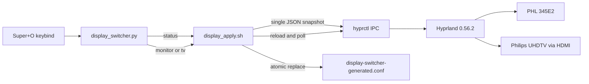

# Native HDMI Display Switcher Architecture

## Status

Approved target design; implementation has not started. The code under `src/` is still the adapter-era implementation and does not satisfy this document.

The authoritative product scope is two exclusive modes:

- `monitor`: Philips 345E2 active; TV disabled.
- `tv`: Philips 55OLED820 active over native HDMI 2.1; monitor disabled.

There is no Extend mode, Mirror mode, audio routing, adapter recovery, or automatic degraded fallback.

## Goals

1. Switch safely between the two exclusive display modes from the existing GTK overlay.
2. Identify displays by EDID identity and connector class, not fixed DRM connector names.
3. Apply TV mode as 3840×2160 at 144 Hz, 10-bit, HDR, and VRR over native HDMI.
4. Verify the effective compositor state rather than assuming a successful `hyprctl` exit means the mode applied.
5. Fail before changing topology when required hardware or the exact target mode is unavailable.
6. Keep the implementation small enough to audit as a hardware control path.

## Non-goals

- Extend or Mirror modes.
- PipeWire, WirePlumber, ALSA, or default audio-sink management.
- CH7218/PCON DPCD writes, DP encoder resets, FRL adapter retries, GPU DPM pinning, or sudo access.
- Automatic fallback to 4K120, 4K60, 1080p144, 8-bit, SDR, or VRR-off operation.
- Migrating the entire HyDE configuration from hyprlang to Lua.
- General-purpose monitor profile management for unknown hardware.

## Grounded Current State

The target machine currently runs Hyprland 0.56.2. Live `hyprctl -j monitors all` discovery on the architecture date reported:

| Role | Current connector | EDID identity | Current active state |
|---|---|---|---|
| Monitor | `DP-2` | `Philips Consumer Electronics Company / PHL 345E2 / UK02226037640` | 3440×1440 @ 74.983 Hz, 10-bit |
| TV | `HDMI-A-1` | `Philips Consumer Electronics Company / Philips UHDTV / 0x01010101` | 3840×2160 @ 60 Hz, 8-bit, SDR, VRR off |

The TV's live mode list did not advertise 3840×2160@144 at that moment. This is an operational precondition, not a fallback decision: TV mode must fail closed until the TV input is set to **Optimal (Auto Game)** and Hyprland advertises a `3840x2160@144...` mode. The implementation must never silently select the advertised `1920x1080@144` mode or downgrade to 4K120.

## Target Profiles

### Monitor profile

| Field | Required value |
|---|---|
| Identity | Exact make/model/serial match for the PHL 345E2 |
| Mode | `3440x1440@74.98` |
| Position | `0x0` |
| Scale | `1` |
| Bit depth | `10` |
| Color preset | `srgb` |
| SDR EOTF | `srgb` |
| SDR saturation | `1.2` |
| VRR | `0` |
| Global HDR preference | off |

The TV is disabled in the final monitor profile.

### TV profile

| Field | Required value |
|---|---|
| Identity | HDMI connector plus exact Philips UHDTV make/model match; ignore dummy serial `0x01010101` |
| Mode | `3840x2160@144` exactly; no fallback |
| Position | `0x0` |
| Scale | `1.5` |
| Bit depth | `10` |
| Color preset | `hdr` |
| SDR brightness | `1.0` |
| SDR saturation | `1.0` |
| SDR minimum luminance | `0.005` |
| SDR maximum luminance | `200` |
| Minimum luminance | `0` |
| Maximum luminance | `1400` |
| Maximum average luminance | `250` |
| Force HDR support | `1` |
| Force wide-color support | `1` |
| VRR | `1` (enabled continuously on this output) |
| Global HDR preference | on |

The desktop monitor is disabled in the final TV profile.

The color and scale values above preserve the last intentional project tuning. Changing those values is a separate calibration decision, not part of the HDMI transport refactor.

## Component Boundaries



### `src/display_switcher.py`: presentation only

Responsibilities:

- Render exactly two mode buttons.
- Ask the applier for `status`; do not parse monitor topology independently.
- Mark the current mode only when status is `monitor` or `tv`.
- Preselect the opposite mode when current state is known; preselect `monitor` when state is `unknown`.
- Invoke the applier asynchronously and surface its success or failure.
- Retain the existing single-instance/PID and keyboard interaction behavior.

The adapter-era eight-second cooldown is removed. Concurrency belongs to the applier lock; the overlay only prevents duplicate windows.

### `src/display_apply.sh`: sole control plane

Responsibilities:

- Own display discovery, state detection, preflight, config generation, application, workspace migration, verification, locking, and concise logging.
- Accept only `status`, `monitor`, or `tv`.
- Read structured monitor data with `hyprctl -j monitors all` and `jq`; never scrape human-readable output.
- Emit only the status token on stdout for `status`. Diagnostics go to stderr and the log.
- Write a single hyprlang `monitorv2` generated file because the deployed HyDE configuration currently sources `display-switcher-generated.conf` after `monitors.conf`.
- Never call sudo or modify kernel, DRM debugfs, sysfs power levels, audio state, notification daemons, wallpaper daemons, or TV settings.

CLI contract:

| Invocation | stdout | Exit |
|---|---|---|
| `display_apply.sh status` | `monitor`, `tv`, or `unknown` | 0 when discovery succeeded |
| `display_apply.sh monitor` | concise success line | 0 only after final verification |
| `display_apply.sh tv` | concise success line | 0 only after final verification |
| Invalid/missing command | usage | 2 |
| Discovery or preflight failure | diagnostic | 3; topology unchanged |
| Apply or verification failure | diagnostic | 4 |
| Another apply is running | diagnostic | 5 |

### Generated configuration: persistent desired state

`~/.config/hypr/display-switcher-generated.conf` contains the complete desired state for both known displays and the mode-specific global HDR preference. It is generated through a temporary file in the same directory and an atomic rename. Partial files must never be visible to Hyprland.

Use the full EDID description in persistent rules so connector renumbering does not invalidate the next reload and the Monitor selector retains its serial. These are verbatim live Hyprland 0.56.2 `description` values, not strings assembled from separate JSON fields:

- `desc:Philips Consumer Electronics Company PHL 345E2 UK02226037640`
- `desc:Philips Consumer Electronics Company Philips UHDTV 0x01010101`

Hyprland selectors match either a connector name or a description prefix; they cannot conjunct EDID identity with `HDMI-A-*`. Runtime discovery therefore enforces the HDMI transport before every TV mutation, while the persistent rule uses the full EDID description for replug stability. The supported physical contract requires the TV to remain on native HDMI. Before intentionally changing its transport, apply Monitor mode so the persisted TV rule is disabled; a later TV request on a DP adapter must fail preflight.

Runtime IPC, workspace migration, and verification use connector names from the current JSON snapshot.

Hyprland 0.56 documents Lua as the preferred configuration format, but this machine still boots through a hyprlang/HyDE source chain. Supporting both formats caused avoidable branches and a second helper. The clean cutover supports the deployed hyprlang path only. A future whole-config Lua migration should replace it once, rather than retaining two generators indefinitely.

### `install.sh`: installation only

Responsibilities:

- Install/symlink only `display_switcher.py` and `display_apply.sh`.
- Install the CSS and verify runtime dependencies: Bash, `hyprctl`, `jq`, Python 3, PyGObject, GTK3, and gtk-layer-shell.
- Verify that `hyprland.conf` sources `display-switcher-generated.conf` after `monitors.conf`; report an actionable error rather than editing unrelated user configuration silently.
- Remove repository-owned stale symlinks for `display-dpm.sh` and `fix-pcon-audio.py` during the clean cutover.

## Hardware Discovery Contract

One JSON snapshot is the source for a decision. Re-query only while polling after an apply.

1. Match the monitor by exact `make`, `model`, and `serial`.
2. Match the TV by connector name matching `^HDMI-A-`, exact `make`, and exact `model`. Do not use the dummy TV serial as identity.
3. Reject duplicate or ambiguous matches for either role and require matched roles to use different connectors.
4. Require exactly one match for the requested target. The non-target role may be absent; a disconnected TV must never block recovery into Monitor mode.
5. Before TV mode, require an advertised mode whose parsed resolution is 3840×2160 and refresh is within 0.1 Hz of 144.
6. Reject a missing, disconnected, or incapable target before writing a file or invoking reload.

Connector names are outputs of discovery, never configuration constants.

## State Model

| Monitor present and enabled | TV present and enabled | Status |
|---|---|---|
| yes | no or absent | `monitor` |
| no or absent | yes | `tv` |
| yes | yes | `unknown` |
| no or absent | no or absent | `unknown` |
| ambiguous role identity | any | discovery error |

`unknown` is a real state, not an alias for monitor mode. It lets the UI recover from manual changes without lying about the current topology.

## Safe Transition Transaction

The transaction preserves the invariant **at least one display remains active throughout**.

```mermaid
sequenceDiagram
    participant UI as Overlay
    participant A as Applier
    participant H as Hyprland
    participant F as Generated config

    UI->>A: monitor | tv
    A->>A: acquire lock
    A->>H: monitors all (JSON)
    A->>A: discover roles + validate exact target profile
    A->>F: snapshot previous file + live HDR preference
    A->>F: atomically write staging config (target active first; keep any active source)
    A->>H: reload
    A->>H: poll until target profile is active
    A->>H: migrate workspaces from any active source → target
    A->>F: atomically write final config (target active; non-target disabled by description)
    A->>H: reload
    A->>H: poll and verify complete final state
    A-->>UI: success only after verification
```

Rules:

1. Validate everything possible before mutation.
2. The staging config enables the target with its final profile while keeping any connected, active source at a non-overlapping `auto-right` position. If no source is connected, the verified target itself satisfies the invariant.
3. Replace arbitrary sleeps with bounded polling: poll structured state every 100 ms for up to five seconds.
4. Migrate active workspaces only after the target is verified active and before disabling a connected source.
5. The final config lists the active target rule before the disabled non-target rule.
6. On failure, restore the previous generated file atomically **without reloading it**, then restore the snapshotted live `quirks:prefer_hdr` value through IPC. This preserves the previous persistent and global HDR state while avoiding another risky monitor transition. Leave the live compositor with whichever one-or-two-display state still has an active output; exit nonzero with observed state.
7. Reapplying the current mode is idempotent and still performs final verification.

No retry reset loop is allowed. A second blind topology transition can hide the first failure and was needed only for the adapter.

## Verification Contract

### Monitor mode

Final JSON must show:

- Monitor enabled, TV disabled.
- Monitor width 3440, height 1440, refresh within 0.1 Hz of 74.98, scale 1.
- Monitor `currentFormat` is one of the compositor's 10-bit formats (`XRGB2101010`, `XBGR2101010`, or `ARGB2101010`).
- Monitor color preset is `srgb`.
- Monitor VRR is false.
- `quirks:prefer_hdr` is false.

### TV mode

Final JSON must show:

- TV enabled, monitor disabled.
- TV connector is still HDMI.
- TV width 3840, height 2160, refresh within 0.1 Hz of 144, scale 1.5.
- TV `currentFormat` is a 10-bit format.
- TV color preset is `hdr`.
- TV VRR is true.
- `quirks:prefer_hdr` is true.

The compositor state is the acceptance source. Log output, generated text, command exit status, and the TV on-screen information panel are supporting evidence, not substitutes.

## Failure Semantics

| Failure | Required behavior |
|---|---|
| Requested target disconnected or not uniquely identified | Exit 3; no mutation |
| 4K144 absent from advertised modes | Exit 3; no mutation and no fallback |
| `jq`/`hyprctl` unavailable or invalid JSON | Exit 3; no mutation |
| Staging target fails verification | Restore previous generated file and live HDR preference; leave source active; exit 4 |
| Final state fails verification | Restore previous generated file without monitor reload, restore live HDR preference through IPC, report all observed profile fields; exit 4 |
| Concurrent apply | Exit 5 immediately |
| UI status returns `unknown` | Show neither mode as current; allow explicit recovery selection |

## Repository Cutover

### Retain

- `src/display_switcher.py`
- `src/display_apply.sh`
- `config/display-switcher.css`
- `install.sh`
- `monitors.conf`, rewritten to the same EDID-based monitor startup profile
- `research/`, as clearly labeled adapter history

### Delete during implementation

- `src/display-dpm.sh`
- `src/fix_pcon_audio.py`
- `src/debug-video.sh`
- `src/lua-monitor-lib.sh`
- `pw.dot`
- Ignored `src/__pycache__/`
- Stale generated Lua files and repository-owned deployed helper symlinks

Mirror/Extend branches, audio sink constants, PCON/DPCD functions, DPM functions, retry modes, fixed `DP-1`/`DP-2` role constants, six-second FRL sleeps, overlay cooldown, and daemon `pkill`/restart behavior are deleted rather than disabled.

## External Migration Boundary

These operations are required for the native-HDMI cutover but are not performed by project code:

1. Set the TV input to **HDMI Ultra HD → Optimal (Auto Game)** so the EDID advertises 4K144 and VRR.
2. Remove `amdgpu.dcdebugmask=0x420000`, `amdgpu.dcfeaturemask=0x0`, and `snd_hda_intel.probe_mask=1` from `/etc/default/limine`.
3. Run `sudo limine-update`, reboot, and verify the parameters are absent from `/proc/cmdline`.
4. Remove obsolete sudoers entries for `display-dpm.sh` and `fix-pcon-audio.py` using `visudo`.

The switcher must not attempt privileged bootloader or sudoers edits.

## Design Decisions

| Decision | Reason |
|---|---|
| Two modes only | Authoritative user scope; removes dead Mirror and unnecessary Extend state |
| Exact TV mode, fail closed | A fallback could silently violate resolution, refresh, bit-depth, HDR, or VRR requirements |
| EDID identity plus runtime connector class | Full EDID selectors survive connector renumbering; runtime preflight rejects a TV not currently connected through native HDMI |
| One applier owns status and mutation | Prevents Python and Bash topology parsers from diverging |
| Structured JSON only | Human-readable `hyprctl` output already caused brittle detection |
| Staged then final reload | Preserves the no-zero-monitor invariant without mixing runtime legacy rules into `monitorv2` state |
| Hyprlang only for this cutover | Matches the deployed HyDE source chain; removes dual-format branching |
| No audio management | Outside the explicitly reduced display-only scope |
| No adapter fallback code | Native HDMI removes the hardware and its failure model |

## References

- [Hyprland monitor configuration](https://github.com/hyprwm/hyprland-wiki/blob/main/content/Configuring/Basics/Monitors.md): description selectors, disabling, bit depth, color management, luminance fields, and per-display VRR.
- [Hyprland variables](https://github.com/hyprwm/hyprland-wiki/blob/main/content/Configuring/Basics/Variables.md): VRR modes and `quirks.prefer_hdr`.
- Baseline checkpoint: `607ccaae0ad4c15ebf5592b72a8530f5ba504bac`.
- Adapter investigation remains under `research/` and is non-authoritative historical context for this design.
